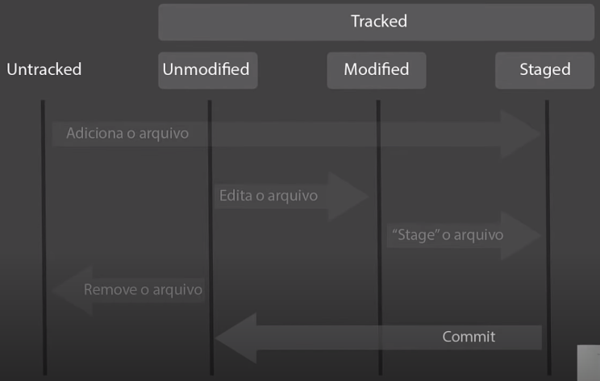

# Introdução ao Git e ao GitHub

Professor Otávio Reis - Perkles._
Fronend Developer - Foton

#Git #Github #Versionamento 

---

## Introdução ao Git

### Entendendo o que é Git e sua importância

-> Sistema distribuido seguro

Software open source que possibilita o versionamento de arquivos (códigos) de forma colaborativa entre vários programadores.

Criado por Linus Torvalds -- mesmo criador do Linux -- o Git revolucionou a forma de versionar código.

> Software é criado de forma colaborativa.

benefícios de git e github:
1. Controle de versão
2. Armazenamento em nuvem
3. Trabalho em equipe
4. Melhora seu código
5. Reconhecimento

---

## Navegação Via Command Line Interface e Instalação

### Comandos básicos para um bom desempenho no terminal

GUI x CLI.
O Git foi projetado para usar via cli.

comandos para:
- Mudar de pasta
- Listar as pastas
- Criar pastas/arquivos
- Deletar pastas/arquivos

Windows
- cd
- dir
- mkdir
- rmdir / del

Unix
- cd 
- ls
- mkdir
- rm -rf

\# silence on success

### Realizando a instalação do GIT

[Download e doc. do GIT](https://git-scm.com/)

---

## Entendendo como o Git funciona por baixo dos panos

### Tópicos fundamentais para entender o funcionamento do Git

- SHA1
- Objetos fundamentais
- Sistema distribuido
- Segurança

**SHA**
Significa Secure Hash Algorithm, que é um conjunto de funções **hash criptográficas** projetadas pela NSA (Agência de Segurança Nacional dos EUA).

A encriptação gera conjunto de characteres identificador de 40 dígitos de acordo com o conteúdo de um arquivo ou saída de dados.

Bash:
```bash
❯ echo "ola mundo" | openssl sha1
SHA1(stdin)= d9802fa01c4c1dfc4ddaf61f766d8d56ad8a8699
```

E o Git utiliza essa abordagem para identificar mudanças em arquivos.

Além disso, o git também utiliza a encriptação SHA1 para Objetos internos.

### Objetos internos do Git

- BLOBS
- TREES
- COMMITS

**Objeto fundamental (Blob)**

```Bash
❯ echo 'conteudo' | git hash-object --stdin
fc31e91b26cf85a55e072476de7f263c89260eb1

❯ echo -e 'conteudo' | openssl sha1
SHA1(stdin)= 65b0d0dda479cc03cce59528e28961e498155f5c
```

No exemplo acima, ambos os comandos geram um SHA1, contudo ocorre uma diferença nas saídas porque o `git hash-object` gera um Objeto fundamental (Blob) que contém meta dados além do conteúdo original

ex.:
```
Blob 42

\0 Ola Mundo
```

logo, então se:

```Bash
❯ echo 'conteudo' | git hash-object --stdin
fc31e91b26cf85a55e072476de7f263c89260eb1

❯ echo -e 'blob 9\0conteudo' | openssl sha1
SHA1(stdin)= fc31e91b26cf85a55e072476de7f263c89260eb1
```

entradas equivalentes -> saídas iguais.

**Tree**

Enquanto blobs guarda apenas o SHA1 de arquivos, uma Tree armazena toda a estrutura de diretórios também em SHA1, apontando para blobs ou outras arvores (trees).

SHA1 hg1a8d...
```
Tree        <tamanho>
\0
blob sa4d8s texto.txt
```

logo se qualquer conteúdo de um arquivo for alterado, o SHA1 de uma respectiva tree também será alterado. O que pode servir de indicativo para o  versionamento de arquivos do Git.


**Commit**

SHA1 487d4s...
```
Commit  <tamanho>

tree      s4a5sq1
parente   a98acq1
autor     tiago
mensagem  "modificação arquivo..."
timestamp 1678248766
```
O SHA1 desse commit é o hash de toda essa informação.

### Chave SSH e Token

[Connecting to github with ssh doc.](https://docs.github.com/pt/authentication/connecting-to-github-with-ssh/about-ssh)

[Creting a personal access token doc.](https://docs.github.com/pt/authentication/keeping-your-account-and-data-secure/creating-a-personal-access-token)

---

## Primeiros Comandos Com Git
### Iniciando o git e criando um commit

- Iniciar o GIT
- Iniciar o versionamento
- Criar um commit
<br>
- git init
- git add
- git commit 

---

## Ciclo de vida dos arquivos no Git
### Passo a passo no ciclo de vida

\#Git init

**Tracked and Untracked**



Untracked:
arquivos que o git não tem ciência; que foram removidos do repositório; ou que foram ignorados.

Tracked:
arquivos que o git tem ciência, podendo um de três estados distintos. Sendo eles:
- Unmodified
	Arquivos tracked, geralmente recém adicionados que não sofreram mudanças e não foram adicionados com `git add`.
- Modified
	Arquivos tracked, que já foram estiveram no staged, mas tiveram seu conteúdo modificado.
- Staged
	Arquivos tracked, que foram adicionados com `git add` e não sofreram mudanças. Prontos para sofrerem `git commit` e, portanto voltarem para o estado Unmodified.


**Repositório**
Local x Remoto

Ambiente de desenvolvimento:
Workink Directory -> Staging Area -> Local Repository

Servidor:
Remote Repository

---

## Introdução ao GitHub
### Trabalhando comm o GitHub

`git remote add origin <endereço http do repo remoto>`
obs: origin no comando acima é apenas umm alias para o endereço http.

---

## Resolvendo conflitos
### Como os conflitos acontece no GitHub e como resolve-los

`git pull origin main`

\# Merge conflict

